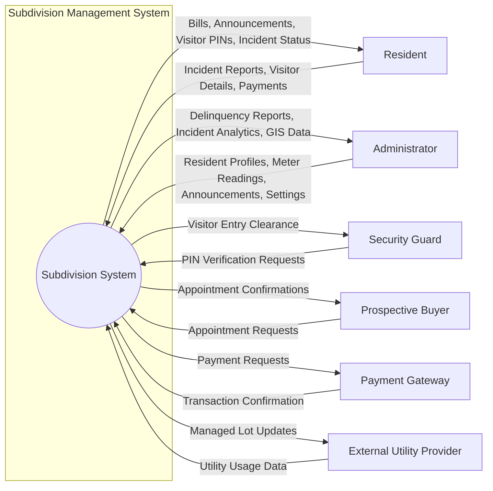

# DFD Level 0 - Subdivision Management System

This Data Flow Diagram (DFD) Level 0 (Context Diagram) represents the entire Subdivision Management System as a single process and illustrates its interactions with external entities.

## Description of Flows

### Resident
- **Inputs**: Submits incident reports (maintenance, security, etc.), provides visitor information for entry PINs, and submits payment confirmations for utilities and dues.
- **Outputs**: Receives billing statements (Electricity, Water, HOA), community announcements, visitor PINs for guests, and updates on the status of reported incidents.

### Administrator
- **Inputs**: Updates resident profiles, enters manual meter readings, publishes community announcements, and manages system-wide configurations.
- **Outputs**: Receives delinquency reports (unpaid bills), data analytics for incidents, GIS monitoring data, and summaries of scheduled appointments.

### Security Guard
- **Inputs**: Requests verification for visitor PINs provided by guests at the gate.
- **Outputs**: Receives clearance or denial alerts for visitor entry.

### Prospective Buyer (Client)
- **Inputs**: Submits requests to view properties or book appointments with the sales team.
- **Outputs**: Receives confirmations and scheduling details for requested appointments.

### Payment Gateway (GCash/Office)
- **Inputs**: Receives payment transaction details from the system.
- **Outputs**: Returns confirmation of successful or failed transactions.

### External Utility Provider (CASURECO/Water District)
- **Inputs**: Provides usage data for lots not managed directly by the subdivision.
- **Outputs**: Receives operational data or updates regarding managed lot statuses.
